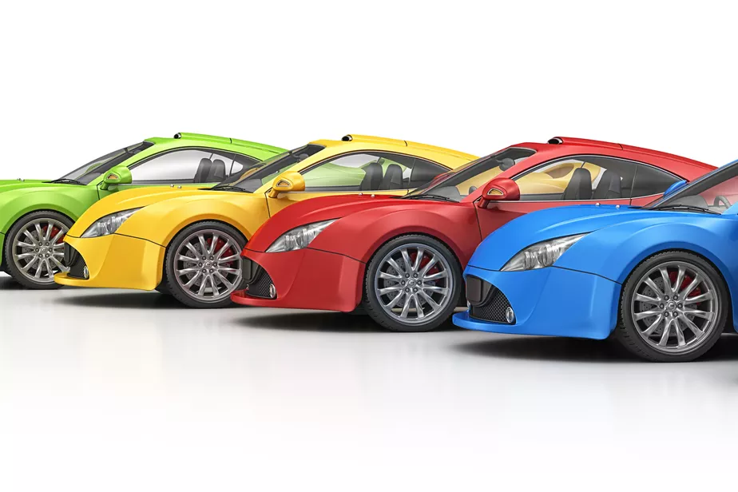

# POO (Programação Orientada a Objeto)

Paradigma que representa os atores e entidades da vida real como objetos.

- O estado de cada entidade é definida pelos atríbutos
- E o comportamento é representado pelos métodos

## Classe e Objeto

O desenho modelo do carro representa uma classe.

Já o objeto, é uma instância da classe, a construção real apartir do prótotipo carro.

